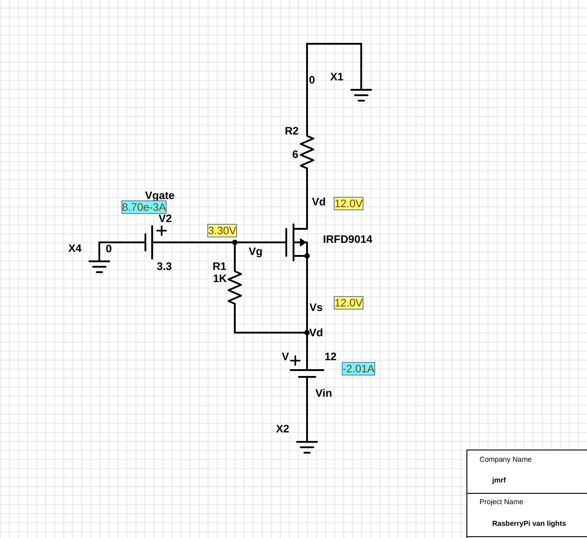

# RaspVan

Domotics using a Raspberry Pi 3 for our own-built campervan.

At the moment it is ~~just a simple prototype~~ complete domotic voice-controled
system.

Commands can be executed either by _voice_ or by sending _HTTP requests_ to a server.


Table of Contents
=================

   * [RaspVan](#raspvan)
   * [Table of Contents](#table-of-contents)
      * [Requirements](#requirements)
      * [Structure](#structure)
      * [How to](#how-to)
         * [Installation](#installation)
            * [WiFi and automatic hotspot](#wifi-and-automatic-hotspot)
            * [Voice Control:](#voice-control)
            * [HTTP Control (Android app or similar):](#http-control-android-app-or-similar)
            * [Web Control Panel (optional)](#web-control-panel-optional)
      * [Wiring and Connections](#wiring-and-connections)
      * [Misc](#misc)

Created by [gh-md-toc](https://github.com/ekalinin/github-markdown-toc)


## Requirements

Apart from any other requirement defined in each of the sub-components we
need the follwing:

*  [Raspbian Buster](https://www.raspberrypi.org/downloads/raspbian/)
   ([installation guide](https://www.raspberrypi.org/documentation/installation/installing-images/README.md))
*  [MQTT](https://mqtt.org/) (mosquitto)
*  python >= 3.6


## Structure

```bash
.
├── ASR
│   ├── client
│   ├── data
│   │   ├── audio
│   │   └── lm
│   ├── logs
│   └── models
│       └── lm
├── diagrams
├── hotword
│   ├── data
│   │   ├── fiona
│   │   └── random
│   ├── logs
│   │   ├── fiona.logs
│   │   └── fiona-om.logs
│   └── models
└── scripts

20 directories
```


## How to

### Installation

#### WiFi and automatic hotspot

In order to communicate with the RaspberryPi we will configure it to connect to
a series of known WiFi networks when available and to create a Hotspot otherwise.

Refer to
[auto-wifi-hotspot](http://www.raspberryconnect.com/network/item/330-raspberry-pi-auto-wifi-hotspot-switch-internet)
from [raspberryconnect/network](http://www.raspberryconnect.com/network).

By default the RaspberryPi will be accessible at the IP: `192.168.50.5` when the hotspot is active.


#### Voice Control:


#### HTTP Control (Android app or similar):

To run the HTTP server:
```bash
	python3 http_server.py
```


Ideally these processes should run on startup, for this we use `systemctl`.

For example to configure a _unit_ for the `voice_action_server`:

1. Create the `.service`:
    ```bash
    # voice-action_server server
    sudo vim /lib/systemd/system/voice_action_ctl.service
    ```

    With the following content:
    ```
    [Unit]
     Description=Python voice to action service
     After=multi-user.target

     [Service]
     Type=idle
     User=pi
     StandardOutput=file:/home/pi/RaspVan/logs/voice_action_server.log
     StandardError=file:/home/pi/RaspVan/logs/voice_action_server_err.log
     ExecStart=/usr/bin/python3 /home/pi/RaspVan/voice_assistant/voice_action_server.py

     [Install]
     WantedBy=multi-user.target

    ```

2. Reload the systemctl daemon:
    ```bash
	sudo systemctl daemon-reload
    ```

3. Enable the service
    ```bash
	sudo systemctl enable voice_action_ctl.service
    ```

To start manually and test proper functioning:
```bash
    sudo systemctl start voice_action_ctl   # start the service
    journalctl -u voice_action_ctl	        # show the logs
    systemctl status voice_action_ctl	    # check status of the service
```


Similarly should be done for the `HTTP python server`.


#### Web Control Panel (optional)

In addition we can configure an Apache server displaying several stats about the RaspberryPi:
(temperature, work load, memory load, etc).

Refer to [GumCP](https://github.com/gumslone/GumCP) for instructions.


## Wiring and Connections

* Lights:

  **Update**:
  Instead of using the _MOSFET_ configuration, is prefered using an array of relays because of encapsulation.
  Switching times increase when using relays but encapsulation of the devices makes life easier.
  We use [these relays](https://amzn.to/2FRfuCP).

  ~~Connections are done from the raspberryPi GPIO pins to the _positive_ side of the lights circuit (high-side switch) using a
  _p-channel MOSFET_ transistor.
  Discussion on low-side or high-side switching are out of the scope of this _readme_ document.~~

 An schematic view of the _switch_ mechanism follows (from this [partsim project](http://www.partsim.com/simulator#132504)):

  


## Misc

* Drawing and simulation tool: [partsim simulator](https://www.partsim.com/simulator)
