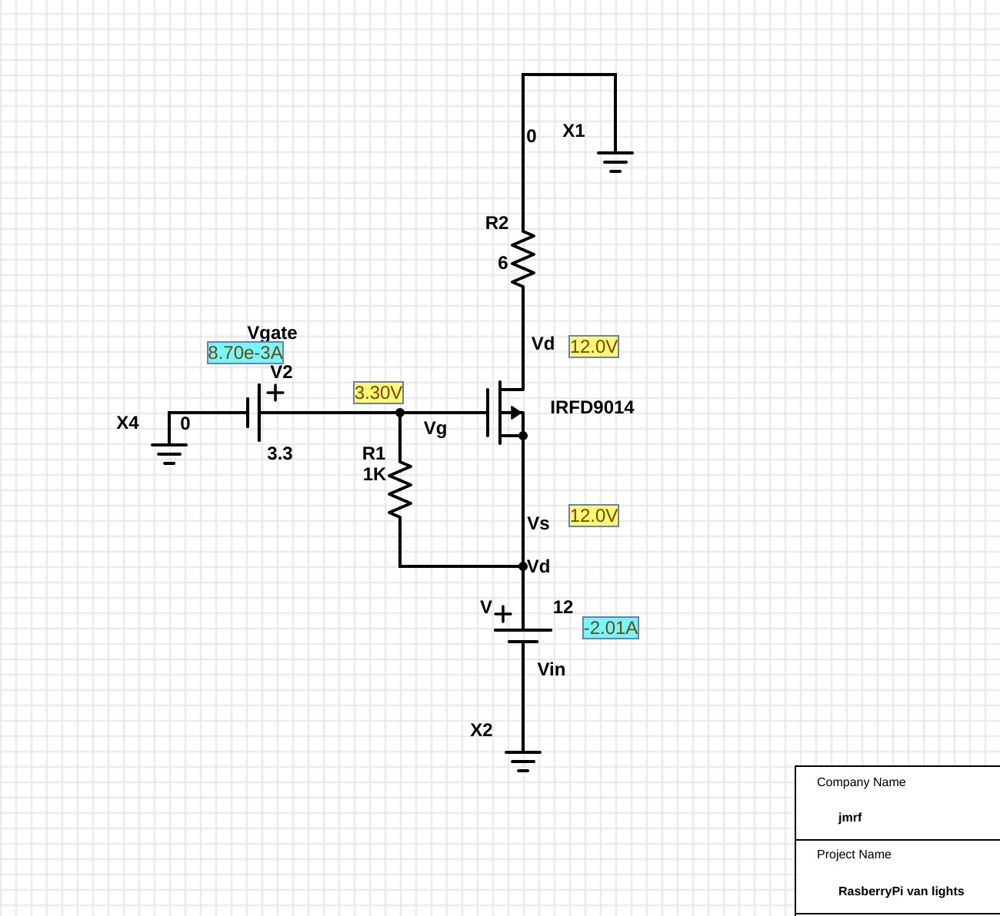

# RaspVan

Domotics using a Raspberry Pi 3 for our own-built campervan.

At the moment is just a simple prototype to control the van lights
either by _voice_ or by sending _POST requests_ to a python server.

This repo as it is works with `Raspbian Stretch` and `Snips version: 0.60.1`.


## Structure

```bash
.
├── http_server.py			    # lights control HTTP server
├── logs				    # log directory
├── raspberry-pi-pinout.png
├── README.md				    # this readme
├── requirements.txt			    # HTTP server requirements
└── voice_assistant			    # voice assistant directory
    ├── assistant_proj_rkr68ZJX-.zip	    # zipped assistant project (ASR, NLU, ...)
    ├── README.md			    # voice assistant README
    ├── requirements.txt		    # voice_action service python requirements
    ├── run_voice_assistant_deprecated.sh   # deprecated
    ├── snips-record-personal-hotword	    # https://github.com/jmrf/snips-record-personal-hotword
    └── voice_action_server.py		    # voice command to action service

```

## Requirements

*  Raspbian Stretch
*  [Snips](https://docs.snips.ai/getting-started/quick-start-raspberry-pi)
*  python3
*  MQTT (mosquitto)


## How to


### Installation

#### Voice control:

For the voice control part the easiest thing is to use [Snips](https://docs.snips.ai/getting-started/quick-start-raspberry-pi)

Once installed, the following steps assumes we are at the route of the repo directory located at `/home/pi/RaspVan`.

To run the voice assitant:
```bash

	python3 voice_assistant/voice_action_server.py
```

#### HTTP Control (Android app or similar):

To run the HTTP server:
```bash
	python3 http_server.py
```


Ideally these processes should run on startup, for this we use `systemctl`.

For example to configure a _unit_ for the `voice_action_server`:

1. Create the `.service`:
    ```bash
    # voice-action_server server
    sudo vim /lib/systemd/system/voice_action_ctl.service
    ```

    With the following content:
    ```
    [Unit]
     Description=Python voice to action service
     After=multi-user.target

     [Service]
     Type=idle
     User=pi
     StandardOutput=file:/home/pi/RaspVan/logs/voice_action_server.log
     StandardError=file:/home/pi/RaspVan/logs/voice_action_server_err.log
     ExecStart=/usr/bin/python3 /home/pi/RaspVan/voice_assistant/voice_action_server.py

     [Install]
     WantedBy=multi-user.target

    ```

2. Reload the systemctl daemon:
    ```bash
	sudo systemctl daemon-reload
    ```

3. Enable the service
    ```bash
	sudo systemctl enable voice_action_ctl.service
    ```

To start manually and test proper functioning:
```bash
    sudo systemctl start voice_action_ctl   # start the service
    journalctl -u voice_action_ctl	    # show the logs
    systemctl status voice_action_ctl	    # check status of the service
```


## Wiring and Connections

* Lights:

  **Update**:
  Instead of using the _MOSFET_ configuration, is prefered using an array of relays because of encapsulation.
  Switching times increase when using relays but encapsulation of the devices makes life easier.
  We use [these relays](https://amzn.to/2FRfuCP)

  ~~Connections are done from the raspberryPi GPIO pins to the _positive_ side of the lights circuit (high-side switch) using a 
  _p-channel MOSFET_ transistor. 
  Discussion on low-side or high-side switching are out of the scope of this _readme_ document.~~

 An schematic view of the _switch_ mechanism follows (from this [partsim project](http://www.partsim.com/simulator#132504)):

  


### Misc

* Drawing and simulation tool: [partsim simulator](https://www.partsim.com/simulator)
