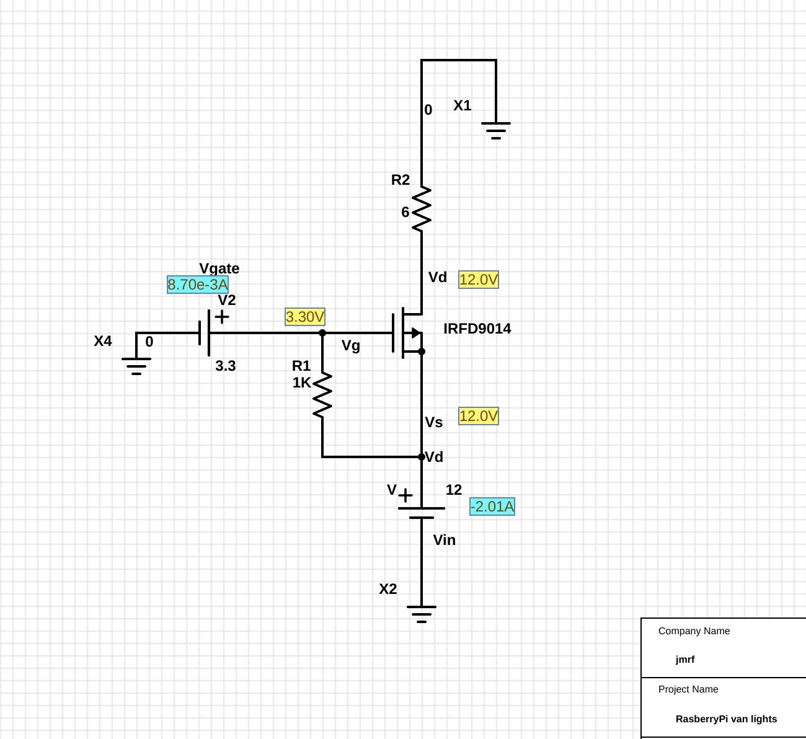

### Voice Control


### HTTP Control (Android app or similar)

To run the HTTP server:
```bash
	python3 http_server.py
```


Ideally these processes should run on startup, for this we use `systemctl`.

For example to configure a _unit_ for the `voice_action_server`:

1. Create the `.service`:
    ```bash
    # voice-action_server server
    sudo vim /lib/systemd/system/voice_action_ctl.service
    ```

    With the following content:
    ```
    [Unit]
     Description=Python voice to action service
     After=multi-user.target

     [Service]
     Type=idle
     User=pi
     StandardOutput=file:/home/pi/RaspVan/logs/voice_action_server.log
     StandardError=file:/home/pi/RaspVan/logs/voice_action_server_err.log
     ExecStart=/usr/bin/python3 /home/pi/RaspVan/voice_assistant/voice_action_server.py

     [Install]
     WantedBy=multi-user.target

    ```

2. Reload the systemctl daemon:
    ```bash
	sudo systemctl daemon-reload
    ```

3. Enable the service
    ```bash
	sudo systemctl enable voice_action_ctl.service
    ```

To start manually and test proper functioning:
```bash
    sudo systemctl start voice_action_ctl   # start the service
    journalctl -u voice_action_ctl	        # show the logs
    systemctl status voice_action_ctl	    # check status of the service
```


Similarly should be done for the `HTTP python server`.


### Web Control Panel (optional)

In addition we can configure an Apache server displaying several stats about the RaspberryPi:
(temperature, work load, memory load, etc).

Refer to [GumCP](https://github.com/gumslone/GumCP) for instructions.


## Wiring and Connections

* Lights:

  **Update**:
  Instead of using the _MOSFET_ configuration, is prefered using an array of relays because of encapsulation.
  Switching times increase when using relays but encapsulation of the devices makes life easier.
  We use [these relays](https://amzn.to/2FRfuCP).

  ~~Connections are done from the raspberryPi GPIO pins to the _positive_ side of the lights circuit (high-side switch) using a
  _p-channel MOSFET_ transistor.
  Discussion on low-side or high-side switching are out of the scope of this _readme_ document.~~

 An schematic view of the _switch_ mechanism follows (from this [partsim project](http://www.partsim.com/simulator#132504)):

  
